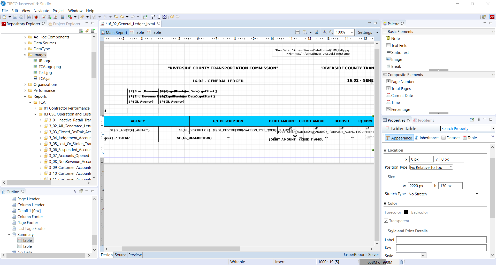
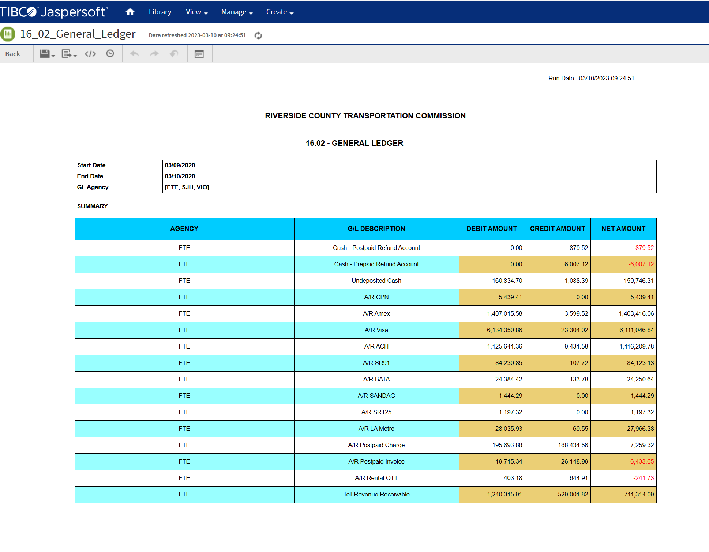

# BRiC TPS

## Background

BRiC TPS is a transaction processing solutions company, and I started working there during the pandemic as a consultant report writer for a contract with a toll road government agency.

My team and I were reponsible for creating 120 report templates to capture billing, transaction, account, sensor, and violation data of customers (e.g., toll fees, violation fees, late fees etc).

These templates provided my supervisor and COO with KPI, revenue, and sensor reports that help them make pertinent data decisions about billing and fees.

## My Role

At the beginning of the project, I met with my supervisor and the COO to gather business requirements of the reports, and once those were finalized, I wrote over 50 report templates over the course of a six-month contract, using JasperReports (also known as JasperSoft), which is a data visualization software similar to Tableau.

JasperReports is Java-based for the conditional logic, and I would run SQL queries written in-house in an IBM DB2 database and then insert these queries into the reports. I would then modify queries to incorporate parameters and QA the queries to ensure they were producing accurate data and were bug-free. If not, I would make necessary modifications.

## Results

By the end of the contract, I deployed over 50 report templates to the client server, and I then met with the COO to verify that everything was running as expected. After the six months was up, a new contract was made for maintenance, for any new templates or modifications to existing templates, such as adding additional parameters or columns (e.g., adding a zip code to an address or changing a date field to a timestamp for more accuracy).

Overall, the client was very happy with the end result, and this toll corridor has been running smoothly for over two and a half years.

## Report Example in JasperReports

## Report Example on the Client Server

To view the query used for this report, please click [here](/bric.sql).

To view the exported Excel spreadsheet for this report, please click [here](/16_02_General_Ledger.xls).

**Developer**

- Caroline Crandell - cecrandell - cecrandell19@gmail.com - [LinkedIn](https://www.linkedin.com/in/carolinecrandell/)
